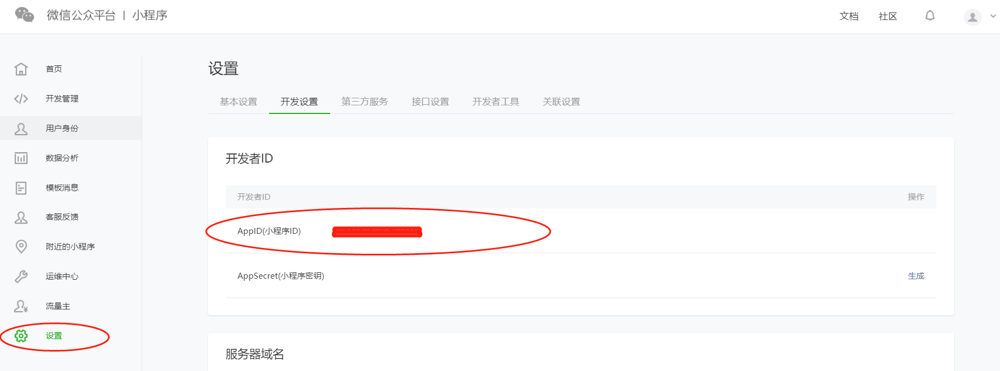
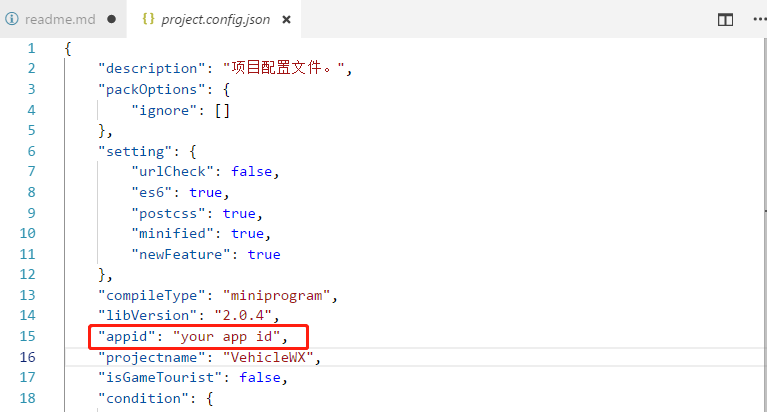
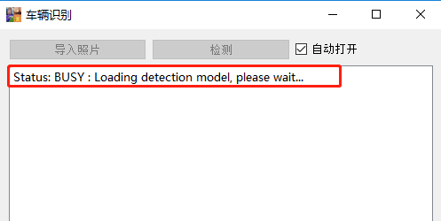
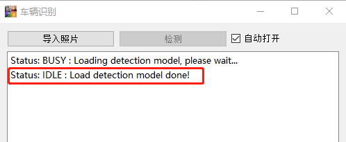
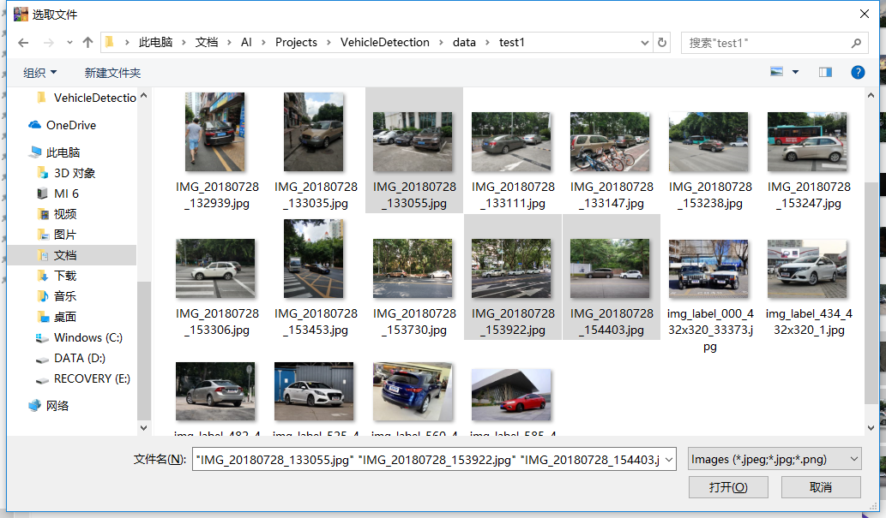
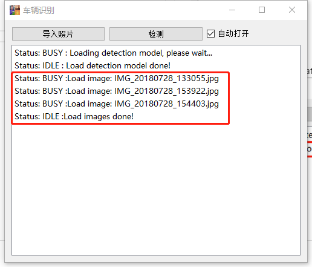
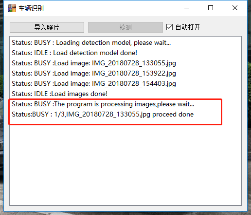
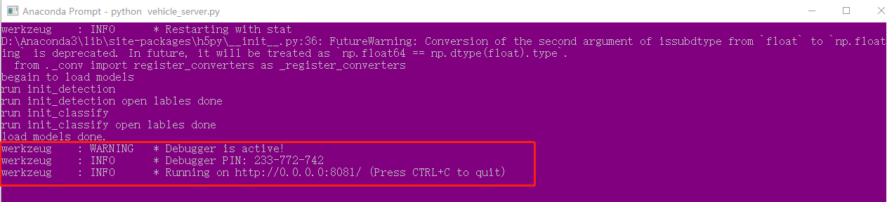
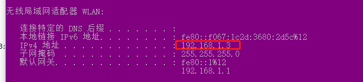
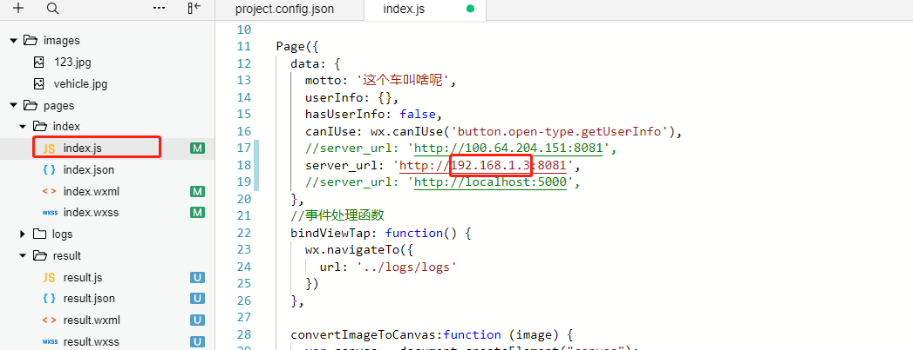

# 
安装使用说明

&nbsp;

# 1. 文件说明
## 1.1 [PC](./PC) 文件夹，包括
### 1）PC端GUI代码和PC端
### 2）PC端微信小程序 Server代码
  
## 1.2 WX文件夹： 微信客户端代码  
## 1.3 Demo文件夹: 演示视频
## 1.4 Train文件夹: Inception V4模型训练代码
&nbsp;

# 2. 安装说明
## 2.1 PC端GUI安装
__GUI依赖库__  
 >__tensorflow(>1.4.0)  
 pyqt5  
 numpy  
 pillow__

## 2.2 模型pb文件下载  
pb文件路径[https://pan.baidu.com/s/1VKiKLMr3CqiLxURxq_stDw](https://pan.baidu.com/s/1VKiKLMr3CqiLxURxq_stDw)  
pb文件存放路径：[./PC/data/twostepclassify](./PC/data/twostepclassify)
 
## 2.3 微信小程序安装 
由于微信小程序未能进行公网测试，没有对外开放，因此需要安装开发环境，在测试版本下调用。
### __服务端依赖库__  
 >__tensorflow(>1.4.0)  
 pyqt5  
 numpy  
 pillow  
 flask__  

### __应用端小程序开发环境安装__  
#### 2.3.1 [微信公众平台](https://mp.weixin.qq.com/)注册个人微信小程序公众号；  
#### 2.3.2 下载微信小程序开发工具;  
#### 2.3.3 在公众平台中获取个人APPID,如下图：  

#### 2.3.4 修改'WX/project.config.json'中的APPID为上一步中获取到的值  
  

&nbsp;
# 3. 使用说明
## 3.1 PC端GUI使用说明
### 3.1.1 运行主程序 ，进入'PC'目录，执行'python vehicle_main.py'
"导入照片"和"检测"按钮都是灰色的，这个时候信息提示"Stauts:BUSY ...."，表示程序处于**忙碌状态**，正在导入models文件，如下图     
  
models导入成功后，显示"Status:IDLE ..."，提示导入models成功，程序处于**空闲状态**，"导入照片"按钮处于活动状态。如下：  
 

### 3.1.2 导入照片  
点击"导入照片"弹出文件选取窗口，选择需要检测的文件，支持多选  
  

导入完成后，GUI界面显示导入文件名称和最终状态，如下：
  

### 3.1.3 检测  
点击"检测"，开始执行检测，检测过程中，每完成一张照片的检测，会提示如下：  
  

全部图片检测完成后：  
  

## 3.2 微信小程序使用说明
### 3.2.1 进入'PC'目录运行，__'python vehicle_server.py'__，成功运行后会出现如下消息：  
  

### 3.2.2 修改'WX/pages/index/index.js'中url中的地址为服务器地址：  
  
    

### 3.2.3 点击'打开相机'或者'从相册导入'上传照片，开始运行，可以使用模拟器或者远程调试，远程调试的微信号需要与小程序绑定的微信号相同，否则不能使用  
  

### 3.2.4 运行过程中会等待服务器运行结束并返回结果，运行成功后小程序会切换到结果界面，如下图：  
  
